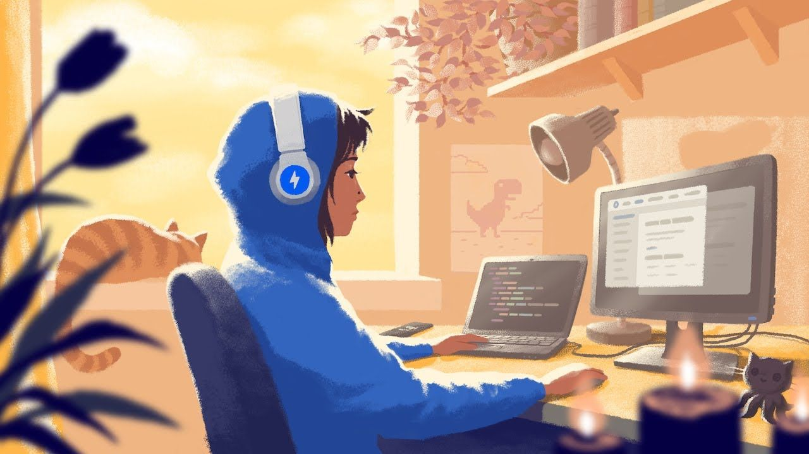

<a align="center" height="400" href="https://https://github.com/HydreNoire"></a>

# 🚀 About
[](https://git.io/typing-svg)
<p>I'm Lise 25 yrs old from 📍 Lyon in 🇫🇷</p>
<ul>
  <li>😄 Pronouns <strong>She/Her</strong> </li>
  <li>🌱 I’m currently learning <strong>Symfony</strong> </li>
  <li>👯 I’m looking for <strong>an internship in Lyon</strong> </li>
  <li>📧 If you want to reach me -> </li>
</ul>

# ✔️ Tasks
- [x] Born
- [x] Making me a really good coffee
- [ ] Finish my training
- [ ] Becoming a junior developer
- [ ] Finish a nice perfect personal project
- [ ] Get a job

# 📊 This week i spent my time on:
```text
Figma      4 hrs
JvaScript  5 hrs 20min
HTML       4 hr 
CSS        3hrs 30 mins
```

# 🛠 Tech Stack
`.html` `.css` `.sass` `.js` `.php` `.symfony`

# 🎶 Now Listening
[](https://github.com/kittinan/spotify-github-profile)
